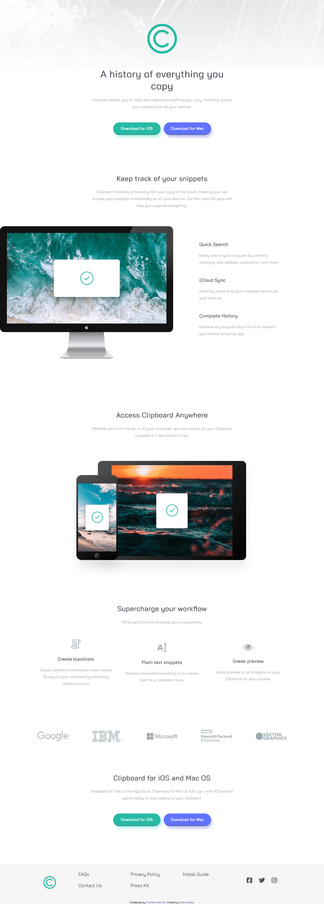

# Frontend Mentor - Clipboard landing page solution

This is a solution to the [Clipboard landing page challenge on Frontend Mentor](https://www.frontendmentor.io/challenges/clipboard-landing-page-5cc9bccd6c4c91111378ecb9). Frontend Mentor challenges help you improve your coding skills by building realistic projects. 

## Table of contents

- [Overview](#overview)
  - [The challenge](#the-challenge)
  - [Screenshot](#screenshot)
  - [Links](#links)
- [My process](#my-process)
  - [Built with](#built-with)
  - [What I learned](#what-i-learned)
  - [Continued development](#continued-development)
  - [Useful resources](#useful-resources)
- [Author](#author)

## Overview

### The challenge

Users should be able to:

- View the optimal layout for the site depending on their device's screen size
- See hover states for all interactive elements on the page

### Screenshot

### Links

- Live Site URL: [Link](https://clipboard-landing-page-master-six-pink.vercel.app/)

## My process
- As usual I used a mobile first workflow.
- I also decided to get out of my comfort zone by learning flexbox and using the framework to design the ENTIRE page.
- Use Font Awesome to add icons.

### Built with

- Semantic HTML5 markup
- CSS custom properties
- Flexbox
- Mobile-first workflow
- Font Awesome

### What I learned

I also decided to get out of my comfort zone by learning flexbox and using the framework to design the ENTIRE page. It was an interesting experiment... but I think from now on I will use Grid for most layouts and flexbox only for specific use case like to center or move about elements within other elements. Relying on flexbox so much resulted in a pretty large and messy media query and me losing track of what CSS statements did what.

A SMALL ADDENDUM:

I decided to learn how to use the CSS transition and and transform properties to enlarge the download buttons upon being hovered over after deploying the website. Came out great!

### Continued development

I want to learn how to combine CSS Grid, Flexbox and vanilla CSS to create appealing web design. In fact, that is going to be my main objective in my next and final project before I learn learning JavaScript.

### Useful resources

- [Flexbox Crash Course by Traversy Media](https://www.youtube.com/watch?v=3YW65K6LcIA) - This was the primary resource I used to learn the basics of Flexbox. A pretty darn good and comprehensive introduction to the framework. It also taught me how to use Font Awesome to add icons to a page and how to use the hover selector which was very useful for this project.

## Author

- Frontend Mentor - [@ginikaifeanyi88-web](https://www.frontendmentor.io/profile/ginikaifeanyi88-web)
